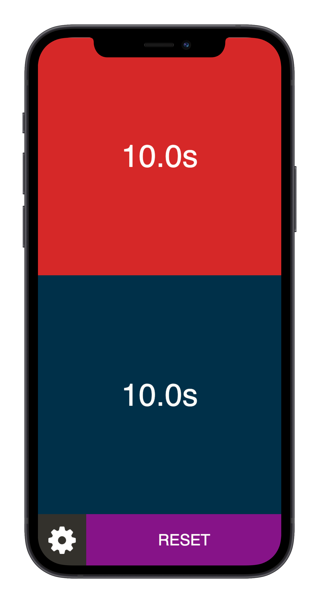

# 2ty.me

A simple 2-sided / tug-o-war style timer for games such as [20 Second Showdown](https://bigpotato.com/gb/games/20-second-showdown/)

[2ty.me](https://2ty.me)

by [Jason Cihelka](https://github.com/jcace)

# How-to

1. Tap the red section to start the timer for red team, blue section to start the timer for blue team
2. Once timer is running, tap anywhere to pause
3. Refer to step 1 to re-start the timer
4. Press Reset to reset the timer
5. Change the duration in the settings (gear) menu
